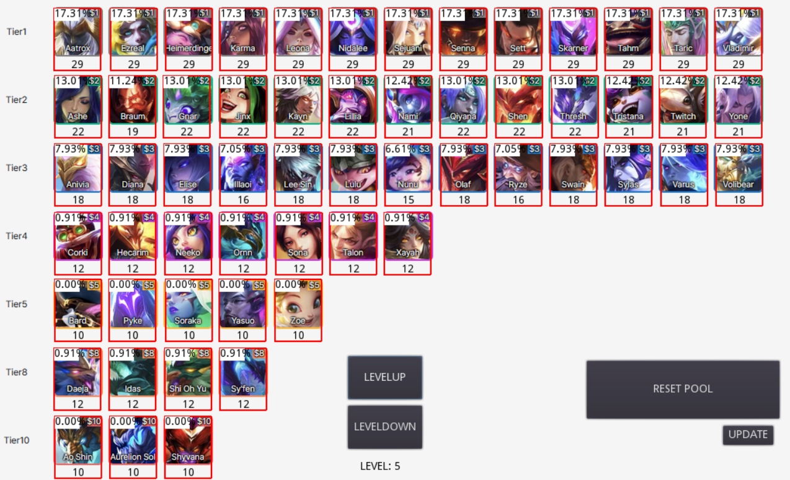

# tft-roll-chances
```TFT Patch: 12.2```

```Godot Version: 3.4.4```

Champion Icons/Roll information from: [lolchess.gg](https://lolchess.gg/guide/reroll)

- Top of icon: chance of getting champ in deck on a roll
- Bottom of icon: number of the champ in the pool
- Right click on icon: remove 1 champ from the pool
- Left click on icon: add 1 champ to the pool


